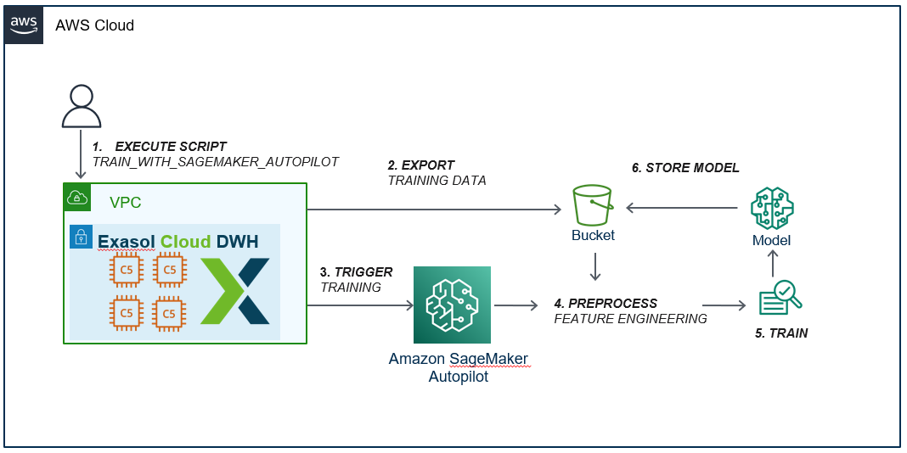

# SageMaker Extension Tutorial

## 1. Introduction
This tutorial walks you through the setup of the Exasol SageMaker-Extension 
project and presents an  use-case of how this extension can be used in Exasol.

The Exasol Sagemaker Extension enables you to develop an end-to-end machine 
learning project on data stored in Exasol using the AWS SageMaker Autopilot service.

The use-case handles a publicly available real-world dataset provided by a heavy 
truck manufacturer (see [Use Case](#use-case)). With the 
provided extension, a machine learning model is developed which allows 
predicting  whether the truck failures are related to a particular component.

### 1.1 AWS Sagemaker Autopilot Service
AWS SageMaker is an AWS public cloud service in which users can build and deploy 
machine learning models. SageMaker provides a number of levels of abstraction to 
users while developing machine learning models. At one of the its highest level 
of abstraction, SageMaker enables users to use an Automated machine learning 
(AutoML) service, called Autopilot in AWS, that automatizes the process of 
applying machine learning  to real world problems.

Autopilot covers a  complete pipeline of developing an end-to end machine learning 
project, from raw data to a deployable model. It is able to automatically build, 
train and tune a number of machine learning models by inspecting your data set. 
In this way, the following tasks, which are repeatedly applied by ML-experts 
in machine learning projects, are automated:
- Pre-process and clean the data.
- Perform feature engineering and select the most appropriate ones
- Determine the most appropriate ML algorithm.
- Tune and optimize hyper-parameters of model.
- Post-process machine learning models.

The Exasol Sagemaker Extension takes these advantages of AWS Autopilot and enables 
users to easily create an effective and efficient machine learning models 
without expert knowledge.

### 1.2 Exasol SageMaker Extension

The Exasol Sagemaker Extension provides a Python library together with Exasol 
Scripts and UDFs that train Machine Learning Models on data stored in Exasol 
using AWS SageMaker Autopilot service.

The extension basically exports a given Exasol table into AWS S3, and then 
triggers Machine Learning training using the AWS Autopilot service with the 
specified parameters. In addition, the training status can be polled using 
the auxiliary scripts provided within the scope of the project. In order to 
perform prediction on a trained Autopilot model, one of the methods is to 
deploy the model to the real-time AWS endpoint. This extension provides Lua 
scripts for creating/deleting real-time endpoint and creates a model-specific 
UDF script for making real-time predictions. The following figure
indicates the overview of this solution.


## 2. Setup the Extension

### 2.1 Installation

In order to use the Exasol SageMaker Extension, it is necessary to install the python package of the Extension 
, upload the given SageMaker-Extension Container into 
BucketFS and then activate the uploaded container in Exasol. These pre-packaged
releases are available in the [Releases](https://github.com/exasol/sagemaker-extension/releases) 
of the Github repository. 

Before starting the installation, let's define the variables required for the 
installation (Please note that you need to change variables below to use your 
own Exasol Database):
```python
DATABASE_HOST="127.0.0. 1"
DATABASE_PORT=9563
DATABASE_USER="sys"
DATABASE_PASSWORD="exasol"
DATABASE_SCHEMA="IDA"
BUCKETFS_PORT=6666
BUCKETFS_USER="w"
BUCKETFS_PASSWORD="write"
BUCKETFS_NAME="bfsdefault"
BUCKET_NAME="default"
PATH_IN_BUCKET="container"
CONTAINER_NAME="exasol_sagemaker_extension_container-release"
CONTAINER_FILE="exasol_sagemaker_extension_container-release.tar.gz"
```

- The sagemaker-extension python package provides a command line tool to 
deploy the Lua and UDF scripts to the database. It is installed as follows 
(Please check [the latest release](https://github.com/exasol/sagemaker-extension/releases/latest)):
    ```sh
    pip install https://github.com/exasol/sagemaker-extension/releases/download/<version>/exasol_sagemaker_extension-<version>-py3-none-any.whl
    ```

- The required libraries and dependencies of the Exasol SageMaker Extension are 
distributed into Exasol by uploading the pre-built Exasol SageMaker-Extension Language 
Container to the BucketFS. You can upload it with any http(s) client that can send 
files via HTTP-Put requests. For more details please check 
[Access Files in BucketFS](https://docs.exasol.com/database_concepts/bucketfs/file_access.htm). 
The following example uploads the pre-built SageMaker-Extension Container to BucketFS with the curl command, a http(s) client:
    ```sh
    curl -vX PUT -T \ 
        "<CONTAINER_FILE>" 
        "http://w:<BUCKETFS_WRITE_PASS>@$bucketfs_host:<BUCKETFS_PASS>/<BUCKETFS_NAME>/<PATH_IN_BUCKET><CONTAINER_FILE>"
    ```

- You need to activate the uploaded container  for your session or the whole system through 
adjusting parameter `SCRIPT_LANGUAGES`.  Please keep in mind, that 
the name of the language alias is assumed to be `PYTHON_SME` in the 
SageMaker-Extension. For more details, please check 
[Adding New Packages to Existing Script Languages](https://docs.exasol.com/database_concepts/udf_scripts/adding_new_packages_script_languages.htm).
The following example query activates the container session-wide:
    ```sh
    ALTER SESSION SET SCRIPT_LANGUAGES=\
    'PYTHON_SME=localzmq+protobuf:///<BUCKETFS_NAME>/<BUCKET_NAME>/<PATH_IN_BUCKET><CONTAINER_NAME>/?\
            lang=python#buckets/<BUCKETFS_NAME>/<BUCKET_NAME>/<PATH_IN_BUCKET><CONTAINER_NAME>/\
            exaudf/exaudfclient_py3 PYTHON3=builtin_python3 PYTHON=builtin_python R=builtin_r JAVA=builtin_java'

    ```

### 2.2 Deployment

The installed SageMaker-extension python package provides a command-line 
interface (CLI), enabling you to deploy all necessary Lua and UDF scripts into 
the specified `DATABASE_SCHEMA` of Exasol Database. The command line is run 
as follows: 

```sh
python -m exasol_sagemaker_extension.deployment.deploy_cli \
    --host <DATABASE_HOST> \ 
    --port <DATABASE_PORT> \
    --user <DATABASE_USER> \
    --pass <DATABASE_PASSWORD> \
    --schema <DATABASE_SCHEMA>
```

After running this deployment command, you should be able to find all the 
required Lua and UDF scripts in the specified schema. To check this, you can 
run the following query: 
```sql
SELECT 
    SCRIPT_NAME , 
    SCRIPT_TYPE 
FROM 
    SYS.EXA_ALL_SCRIPTS 
WHERE 
    SCRIPT_SCHEMA='IDA';
```

|SCRIPT_NAME                            |SCRIPT_TYPE|
|---------------------------------------|-----------|
|SME_TRAIN_WITH_SAGEMAKER_AUTOPILOT     |SCRIPTING  |
|SME_AUTOPILOT_TRAINING_UDF             |UDF        |
|SME_POLL_SAGEMAKER_AUTOPILOT_JOB_STATUS|SCRIPTING  |
|SME_AUTOPILOT_JOB_STATUS_POLLING_UDF   |UDF        |
|SME_DEPLOY_SAGEMAKER_AUTOPILOT_ENDPOINT|SCRIPTING  |
|SME_AUTOPILOT_ENDPOINT_DEPLOYMENT_UDF  |UDF        |
|SME_DELETE_SAGEMAKER_AUTOPILOT_ENDPOINT|SCRIPTING  |
|SME_AUTOPILOT_ENDPOINT_DELETION_UDF    |UDF        |

### 2.3 Create Connection to AWS

The Exasol SageMaker Extension needs to connect to AWS SageMaker and your AWS S3 bucket. 
For that, it needs AWS credentials that has AWS Sagemaker Execution permissions. 
The required credentials are AWS Access Key (Please check how to 
[create an access key](https://docs.aws.amazon.com/IAM/latest/UserGuide/id_credentials_access-keys.html#Using_CreateAccessKey)).


In order for the SageMaker-Extension to use the Access Key, you need to create 
an Exasol `CONNECTION` object which securely stores your keys. For more information, 
please check [Create Connection in Exasol](https://docs.exasol.com/sql/create_connection.htm?Highlight=connection):  


Before creating the connection object, let's define the variables for the 
AWS connection (Please note that you need to use your own credentials for 
below variables.)
```python
AWS_BUCKET="ida_dataset_bucket"
AWS_REGION="eu-central-1"
AWS_KEY_ID="*****"
AWS_ACCESS_KEY="*****"
AWS_CONNECTION_NAME="AWS_CONNECTION"
```

The Exasol `CONNECTION` object object is created as follows: 
```sh
CREATE OR REPLACE  CONNECTION <CONNECTION_NAME>
    TO 'https://<AWS_BUCKET>.s3.<AWS_REGION>.amazonaws.com/''
    USER '<AWS_KEY_ID>'
    IDENTIFIED BY '<AWS_ACCESS_KEY>'
```


## 3. Use Case
In the use case, the publicly available [Air pressure system failures in Scania trucks](https://archive.ics.uci.edu/ml/datasets/IDA2016Challenge) 
dataset is used. The dataset is  provided by  Scania CV AB as a challenge 
dataset in Industrial Challenge at the [15th International Symposium on 
Intelligent Data Analysis (IDA)](https://ida2016.blogs.dsv.su.se/) in 2016.

The dataset consists of data collected from heavy Scania trucks in everyday usage. The dataset includes two different classes accroding to Air Pressure system (APS): (1) The positive class 
consists of component failures for a specific component of the APS system. (2) The negative class consists of trucks with failures for components not related to the APS. 

In this use case,  it is proposed to develop a predictive machine learning model using our SageMaker-Extension to classify failures according to whether they are related to APS, or not. 

### 3.1 Load the Dataset
The following python script downloads the train and test datasets as CSV files 
to the local file system. Then it creates `TRAIN` and `TEST` tables in the 
specified `DATABASE_SCHEMA` of Exasol and imports the downloaded csv files 
to these tables respectively.

```python
import pyexasol
import pandas as pd
from zipfile import ZipFile
from urllib.request import urlopen

DATABASE_CONNECTION = "{host}:{port}".format(host=DATABASE_HOST, port=DATABASE_PORT)
exasol = pyexasol.connect(
    dsn=DATABASE_CONNECTION,
    user=DATABASE_USER,
    password=DATABASE_PASSWORD,
    compression=True)

DATA_URL = "https://archive.ics.uci.edu/ml/machine-learning-databases/00414/to_uci.zip"
TRAINING_FILE = "to_uci/aps_failure_training_set.csv"
TEST_FILE = "to_uci/aps_failure_test_set.csv"

# Data is preceeded with a 20-line header (copyright & license)
NUM_SKIP_ROWS = 20
NA_VALUE = "na"

# Download datasets as csv files
resp = urlopen(DATA_URL)
with open('to_uci.zip', 'wb') as f:
    f.write(resp.read())
with ZipFile('to_uci.zip') as z:
    with z.open(TRAINING_FILE, "r") as f:
        train_set = pd.read_csv(f, skiprows=NUM_SKIP_ROWS, na_values=NA_VALUE)
    with z.open(TEST_FILE, "r") as f:
        test_set = pd.read_csv(f, skiprows=NUM_SKIP_ROWS, na_values=NA_VALUE)

# Create the schema if not exists
exasol.execute(
    query="CREATE SCHEMA IF NOT EXISTS {schema!i}", 
    query_params={"schema": DATABASE_SCHEMA})

# Define column names and types
column_names = list(train_set.columns)
column_types = ["VARCHAR(3)"] + ["DECIMAL(18,2)"] * (len(column_names) - 1)
column_desc = [" ".join(t) for t in zip(column_names, column_types)]
params = {
    "schema": DATABASE_SCHEMA, 
    "column_names": column_names, 
    "column_desc": column_desc}

# Create tables for data
exasol.execute(
    query="CREATE OR REPLACE TABLE {schema!i}.TRAIN(" 
          + ", ".join(column_desc) + ")", 
    query_params=params)
exasol.execute(
    query="CREATE OR REPLACE TABLE {schema!i}.TEST "
          "LIKE {schema!i}.TRAIN", 
    query_params=params)

# Import data into Exasol
exasol.import_from_pandas(train_set, (DATABASE_SCHEMA, "TRAIN"))
print(f"Imported {exasol.last_statement().rowcount()} rows into TRAIN.")
exasol.import_from_pandas(test_set, (DATABASE_SCHEMA, "TEST"))
print(f"Imported {exasol.last_statement().rowcount()} rows into TEST.")
```

### 3.2 Train with SageMaker Autopilot

When you execute the SQL command to train a model, the Exasol SageMaker-Extension 
exports the specified table from the Exasol Database to your specified 
AWS S3 bucket. This export operation is highly efficient, as it is performed 
in parallel. After that the execution script calls Amazon SageMaker Autopilot, 
which automatically perform an end-to end machine learning development, 
to build a model. The following figure indicates this solution. 



First, let's define the variables required to execute the training SQL command:
```python
JOB_NAME="APSClassifier"
IAM_SAGEMAKER_ROLE="*****"
S3_BUCKET_URI="s3://<AWS_BUCKET>" 
S3_OUTPUT_PATH="ida_dataset_path"
INPUT_TABLE_NAME="TARGET"
TARGET_COLUMN="CLASS"
MAX_CANDIDATES=2
```

The following command exports the `TRAIN` table  in the `DATABASE_SCHEMA`  using 
the credentials stored in the `AWS_CONNECTION` into AWS `S3_OUTPUT_PATH`  and 
enables Autopilot to start a job with the  `JOB_NAME`. Please note that 
`JOB_NAME`  must be unique to the corresponding account, and it is 
case-insensitive. In addition,  the maximum number of candidate models is 
limited to 2 by an optional parameter called `max_candidates`. On the other side, 
the other optional parameters that are not set in this sample SQL command 
such as `problem_type`, `objective` ... etc. will be inferenced by Autopilot. 
For more information please check the [User Guide](https://github.com/exasol/sagemaker-extension/blob/main/doc/user_guide/user_guide.md).


```sh
EXECUTE SCRIPT IDA."SME_TRAIN_WITH_SAGEMAKER_AUTOPILOT"(
'{
    "job_name"                          : "<JOB_NAME>",
    "aws_credentials_connection_name"   : "<AWS_CONNECTION_NAME>",
    "aws_region"                        : "<AWS_REGION>",
    "iam_sagemaker_role"                : "<IAM_SAGEMAKER_ROLE>", 
    "s3_bucket_uri"                     : "<S3_BUCKET_URI>",
    "s3_output_path"                    : "<S3_OUTPUT_PATH>",
    "input_schema_name"                 : "<DATABASE_SCHEMA>",
    "input_table_or_view_name"          : "<INPUT_TABLE_NAME>",
    "target_attribute_name"             : "<TARGET_COLUMN>",
    "max_candidates"                    : <MAX_CANDIDATES>
}');
```

This SQL command does not wait for the job to finish after calling Autopilot 
and completes its execution. The metadata information of the created Autopilot
job is saved into the `SME_METADATA_AUTOPILOT_JOBS` table. You can query this 
table as follows:
```sql
SELECT
    * 
FROM 
    IDA."SME_METADATA_AUTOPILOT_JOBS";
```

|DATETIME                  |JOB_NAME     |AWS_CREDENTIALS_CONNECTION_NAME|S3_BUCKET_URI          |S3_OUTPUT_PATH  |TARGET_ATTRIBUTE_NAME|PROBLEM_TYPE|OBJECTIVE| ... |
---------------------------|-------------|-------------------------------|-----------------------|----------------|---------------------|------------|---------| --- |
|2021-11-24-13.35.11.569000|APSClassifier|AWS_CONNECTION                 |s3://ida-dataset-bucket|ida_dataset_path|CLASS                |            |         | ... |


### 3.3 Poll Training Status
As mentioned in the above section, the training SQL script runs asynchronously. 
Therefore, you don't have to wait the training to finish. However, you can poll 
the status of the Autopilot training job with the polling SQL script provided 
by Exasol SageMaker-Extension. This SQL command takes the name of the job 
whose status will be queried, namely `JOB_NAME`, as input and returns the 
current status of the job. For more information please check the 
[User Guide](https://github.com/exasol/sagemaker-extension/blob/main/doc/user_guide/user_guide.md). 
You can execute the polling SQL command as follows:

```sh
EXECUTE SCRIPT IDA."SME_POLL_SAGEMAKER_AUTOPILOT_JOB_STATUS"(
  '<JOB_NAME>',
  '<AWS_CONNECTION_NAME>', 
  '<AWS_REGION>'
);
```

You can below see the sample results of this polling SQL command executed 
several times while the "APSClassifier" training job is running:

|JOB_STATUS|JOB_SECONDARY_STATUS|
|----------|--------------------|
|InProgress|AnalyzingData       |


|JOB_STATUS|JOB_SECONDARY_STATUS|
|----------|--------------------|
|InProgress|FeatureEngineering  |


|JOB_STATUS|JOB_SECONDARY_STATUS|
|----------|--------------------|
|Completed |Completed           |

### 3.4 Deploy Sagemaker Endpoint
In order to perform prediction on a trained Autopilot model, one of the methods 
is to deploy the model to the real-time AWS SageMaker endpoint. You can use the 
deployment SQL command to create a real-time endpoint and deploy the best 
candidate  model of the trained Autopilot jobs on it. The deployment SQL command 
additionally generates the prediction UDF script which is specific to the 
deployed endpoint so that you are able to perform real-time predictions.
The following figure indicates this solution. 


First, let's define the variables required to execute the deployment SQL command:
```python
ENDPOINT_NAME="APSPredictor"
INSTANCE_TYPE="ml.m5.large"
INSTANCE_COUNT=1 
DATABASE_PRED_SCHEMA="IDAPrediction"
```

The following deployment SQL command creates a SageMaker endpoint called 
`EDNPOINT_NAME` and deploys the best model of `JOB_NAME` on it. Please keep 
in mind, that the `ENDPOINT_NAME` is also the name of the UDF script generated 
for the prediction. Furthermore, you can specify a different schema 
(`DATABASE_PRED_SCHEMA`) for the prediction UDF script to be installed 
than the one in which the scripts of the Exasol SageMaker-Extension project 
are deployed. For more information please check the 
[User Guide](https://github.com/exasol/sagemaker-extension/blob/main/doc/user_guide/user_guide.md). 
You can execute the deployment script with the defined variables as follows:

```sh
EXECUTE SCRIPT IDA."SME_DEPLOY_SAGEMAKER_AUTOPILOT_ENDPOINT"(
  '<JOB_NAME>', 
  '<ENDPOINT_NAME>', 
  '<DATABASE_PRED_SCHEMA>', 
  '<INSTANCE_TYPE>',  
  <INSTANCE_COUNT>, 
  '<AWS_CONNECTION_NMAE>', 
  '<AWS_REGION>'
);
```

You should be able to see the created UDF script for prediction, as follows:

```sql
SELECT 
  SCRIPT_NAME,
  SCRIPT_LANGUAGE
FROM 
  SYS.EXA_ALL_SCRIPTS
WHERE 
  SCRIPT_SCHEMA = 'IDAPrediction'
  AND SCRIPT_TYPE = 'UDF'

```

|SCRIPT_NAME                          |SCRIPT_LANGUAGE|
|-------------------------------------|---------------|
|APSPredictor                         |PYTHON3_SME    |

### 3.5 Predict via SageMaker Endpoint

The Exasol SageMaker-Extension generates a prediction UDF for each model, 
enabling you to perform prediction on the deployed endpoint. The name of the 
prediction script is the same as the name of the endpoint (`ENDPOINT_NAME`) 
specified when creating the endpoint. 

The prediction UDF makes a real-time  and synchronous call to the SageMaker 
endpoint. The prediction SQL command takes all the columns used while 
creating the model as inputs, appends the prediction result to these columns and 
the response is returned immediately. For more information, please check the 
[User Guide](https://github.com/exasol/sagemaker-extension/blob/main/doc/user_guide/user_guide.md).
You can  make prediction for this use case as follows:

```sql
SELECT IDAPrediction."APSPredictor"(
  AA_000,AB_000,AC_000,AD_000,AE_000,AF_000,AG_000,
  ...
  EE_005,EE_006,EE_007,EE_008,EE_009,EF_000,EG_000
) FROM IDA.TEST
GROUP BY IPROC(),
MOD(ROWNUM, 6));
```

|AA_000    |AB_000|AC_000       |AD_000 |AE_000 |AF_000 |AG_000| ...  |PREDICTIONS |
|----------|------|-------------|-------|-------|-------|------|------|------------|
|  79492.00|      |         0.00|       |   0.00|   0.00|  0.00| ...  |         neg|
|  41026.00|      |       518.00| 392.00|   0.00|   0.00|  0.00| ...  |         neg|
|  43728.00|  0.00|2130706432.00| 144.00| 522.00| 142.00|  0.00| ...  |         neg|
|  55896.00|      |        74.00|  70.00|   0.00|   0.00|  0.00| ...  |         neg|
|  40122.00|      |       232.00| 210.00|   0.00|   0.00|  0.00| ...  |         neg|
|       ...|   ...|          ...|    ...|    ...|    ...|   ...| ...  |         ...|

Please keep in mind, that yyou can get high efficiency by executing the prediction 
UDF script using the `GROUP BY IPROC()` statement, which allows you to perform 
predictions on each node in parallel. 

### 3.6 Delete Endpoint
It is important to delete the endpoint created, when you are finished with the 
endpoint Otherwise, the endpoint will continue to be charged. You can use the 
following SQL command to delete the endpoint and associated resources.

```sh
EXECUTE SCRIPT IDA."SME_DELETE_SAGEMAKER_AUTOPILOT_ENDPOINT"(
  '<ENDPOINT_NAME>', 
  '<AWS_CONNECTION_NAME>', 
  '<AWS_REGION>'
 ); 
```

## 4.Conclusion
In this tutorial, we went through each steps of the installation and deployment 
of the Exasol SageMaker-Extension, and examined in detail how it works on 
a real-world problem.

The Exasol SageMaker-Extension provides a simple installation with the 
pre-packaged releases and perform a functional deployment with an easy-to-use 
CLI tool. The SQL commands which come with the deployment enable you to create 
the machine learning model of the table you want using the SageMaker Autopilot 
service and make your predictions. 
